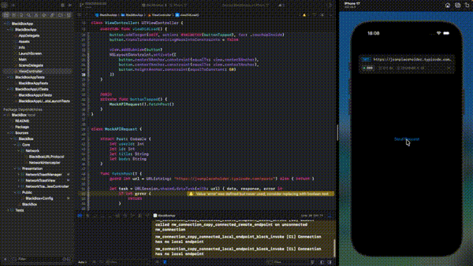

# BlackBox

**BlackBox** is a lightweight, zero-dependency iOS debugging toolkit built as a Swift Package. It intercepts every network request your app makes, displays real-time toast notifications directly on screen, and gives you instant access to response bodies, headers, and cURL commands — without ever leaving your app or opening an external tool.


---

## Features

- 🔍 **Network Interception** — Hooks into `URLProtocol` to capture all HTTP/HTTPS traffic automatically
- 🍞 **In-App Toast Notifications** — Shows method, URL, status code, duration, and response size as a floating overlay
- 📋 **Response Inspector** — View pretty-printed JSON, request/response headers, and a ready-to-run cURL command
- 🎨 **Color-Coded Methods & Status Codes** — GET, POST, PUT, DELETE, PATCH each have distinct colors; status codes follow HTTP semantics
- ⚙️ **Single-Line Setup** — One `configure()` call wires everything together
- 📦 **Zero Dependencies** — Pure Swift, no third-party libraries required
- 🔒 **Thread-Safe** — Built with `NSLock` and `@MainActor` to handle concurrent requests safely

---

## Requirements

| | Minimum |
|---|---|
| iOS | 13.0+ |
| Swift | 5.5+ |
| Xcode | 13.0+ |

---

## Installation

### Swift Package Manager

In Xcode, go to **File → Add Package Dependencies** and enter the repository URL:

```
https://github.com/Furkanvural10/black-box.git
```

Or add it manually to your `Package.swift`:

```swift
dependencies: [
    .package(url: "https://github.com/Furkanvural10/black-box.git", from: "1.0.0")
],
targets: [
    .target(
        name: "YourApp",
        dependencies: ["BlackBox"]
    )
]
```

---

## Quick Start

### 1. Configure in AppDelegate

```swift
import BlackBox

@main
class AppDelegate: UIResponder, UIApplicationDelegate {

    func application(
        _ application: UIApplication,
        didFinishLaunchingWithOptions launchOptions: [UIApplication.LaunchOptionsKey: Any]?
    ) -> Bool {

        var config = BlackBox.Config()
        config.enableNetworkInterception = true
        config.showNetworkToast = true
        config.toastDuration = 6.0
        BlackBox.configure(config)

        return true
    }
}
```

### 2. Configure in SwiftUI App

```swift
import SwiftUI
import BlackBox

@main
struct MyApp: App {

    init() {
        var config = BlackBox.Config()
        config.enableNetworkInterception = true
        BlackBox.configure(config)
    }

    var body: some Scene {
        WindowGroup {
            ContentView()
        }
    }
}
```

That's it. BlackBox will automatically intercept every `URLSession` request your app makes and display a toast for each one.

---

## Configuration

All options are set through `BlackBox.Config` before calling `BlackBox.configure(_:)`.

```swift
var config = BlackBox.Config()

// Enable network traffic interception via URLProtocol
config.enableNetworkInterception = true

// Show in-app toast overlays for each request/response
config.showNetworkToast = true

// How long each toast stays visible (in seconds)
config.toastDuration = 6.0


// UI framework used to render the toast overlay
config.presentationMode = .uiKit  // or .swiftUI

BlackBox.configure(config)
```

### Configuration Options

| Property | Type | Default | Description |
|---|---|---|---|
| `enableNetworkInterception` | `Bool` | `false` | Registers `URLProtocol` subclass to intercept all requests |
| `showNetworkToast` | `Bool` | `true` | Displays floating toast for each intercepted request |
| `toastDuration` | `TimeInterval` | `6.0` | Seconds before the toast auto-dismisses |
| `presentationMode` | `PresentationMode` | `.uiKit` | Rendering framework for the toast UI |

> **Note:** `enableNetworkInterception` is `false` by default. Enabling it registers a global `URLProtocol` that intercepts all network traffic. Only enable this in debug builds.

---

## How It Works

BlackBox is built on three cooperating layers:

```
URLSession Request
       │
       ▼
BlackBoxURLProtocol        ← Registered via URLProtocol.registerClass()
       │                     Intercepts every request before it leaves the app
       │
       ▼
NetworkInterceptor         ← Notifies registered observers on the main thread
       │
       ├──▶ NetworkToastManager   ← Manages toast window lifecycle and queue
       │           │
       │           ▼
       │    NetworkToastViewController / NetworkToastView
       │           └── Shows method, status, duration, size, JSON, headers, cURL
       │
       └──▶ Your own handlers via onRequestStarted / onResponseReceived
```

### Intercepting Requests Without Infinite Loops

`BlackBoxURLProtocol` marks each request it creates with a custom `URLProtocol` property. When `canInit(with:)` is called again for that same request, it returns `false` — preventing the protocol from intercepting its own outgoing requests and causing an infinite loop.

### Request Queuing

If a new network request arrives while a toast is already on screen, it is added to an internal pending queue. Requests are shown one at a time in the order they arrive, ensuring the UI is never flooded.

---

## Advanced Usage

### Listening to Network Events in Your Own Code

You can register custom handlers to receive request and response events independently of the toast UI:

```swift
NetworkInterceptor.shared.onRequestStarted { request in
    print("→ \(request.method) \(request.url)")
}

NetworkInterceptor.shared.onResponseReceived { response in
    print("← \(response.statusCode) in \(response.formattedDuration)")
}
```

### Generating a cURL Command

Every intercepted request can be exported as a `curl` command:

```swift
let curl = request.toCURL()
// curl -X POST 'https://api.example.com/login' \
//   -H 'Content-Type: application/json' \
//   -d '{"email":"user@example.com"}'
```

### Enabling Only in Debug Builds

It is strongly recommended to gate BlackBox behind a compile-time flag so it is never active in production:

```swift
#if DEBUG
var config = BlackBox.Config()
config.enableNetworkInterception = true
BlackBox.configure(config)
#endif
```

---

## NetworkRequest

| Property | Type | Description |
|---|---|---|
| `id` | `UUID` | Unique identifier for this request |
| `method` | `String` | HTTP method (GET, POST, etc.) |
| `url` | `URL` | Full request URL |
| `headers` | `[String: String]` | Request headers |
| `body` | `Data?` | Request body, if present |
| `timestamp` | `Date` | Time the request was initiated |

```swift
func toCURL() -> String
```

Converts the request into an executable `curl` command string.

---

## NetworkResponse

| Property | Type | Description |
|---|---|---|
| `requestId` | `UUID` | Matches the originating `NetworkRequest.id` |
| `statusCode` | `Int` | HTTP status code |
| `headers` | `[String: String]` | Response headers |
| `data` | `Data?` | Raw response body |
| `duration` | `TimeInterval` | Time elapsed from request start to response |
| `timestamp` | `Date` | Time the response was received |

```swift
var isSuccess: Bool          // true for 2xx status codes
var formattedDuration: String // e.g. "142 ms" or "1.34 s"
var formattedDataSize: String? // e.g. "2.4 KB" or "1.1 MB"
var prettyJSON: String?       // Pretty-printed JSON string, if applicable
```

---

## Toast UI

The toast overlay appears at the top of the screen and supports two states:

**Collapsed** — shows method badge, URL, status code, duration, and response size at a glance.

**Expanded** — tap the chevron to reveal a segmented inspector with three tabs:

| Tab | Content |
|---|---|
| Response | Pretty-printed JSON response body |
| Headers | Response and request headers |
| Request | Full `curl` command |

Tapping outside the toast dismisses it immediately. While expanded, the auto-dismiss timer is paused.

---

## Important Notes

- BlackBox intercepts requests made through `URLSession`. Requests using lower-level networking APIs (e.g. raw sockets) are not captured.
- The `URLProtocol` registration affects the **shared** session configuration. If your app uses custom `URLSession` configurations, you may need to add `BlackBoxURLProtocol` to those configurations manually.

---

## Author

Built by [Furkan Vural](https://github.com/furkanvural10).  
If you find this useful, consider leaving a ⭐️ on GitHub.
